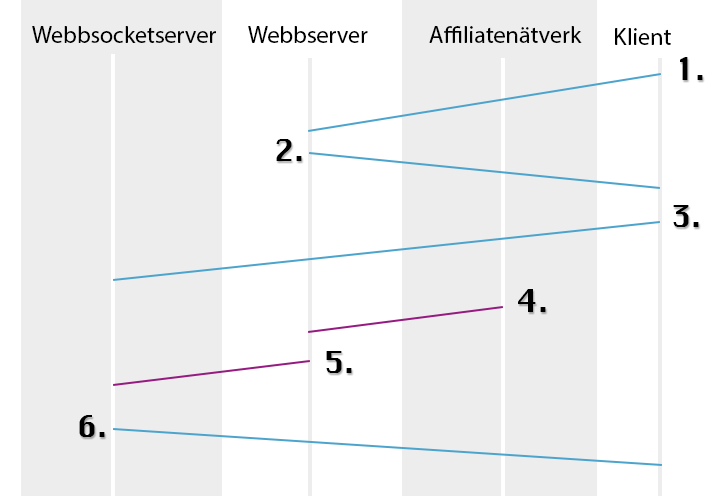

<h1>Projekt i webbteknik 2 - 1dv449</h1>

Viktor Nilsson, vn222ay

Testapplikation: <a href="http://83.254.136.119/Projekt">http://83.254.136.119/Projekt</a>

Genomför testförsäljning genom denna länk: <a href="http://83.254.136.119/Projekt/demosale.php">http://83.254.136.119/Projekt/demosale.php</a>

Presentation: <a href="http://www.vn222ay.se/PresentationProjekt.mp4">http://www.vn222ay.se/PresentationProjekt.mp4</a>

<h2>Inledning</h2>

Jag har ett par sidor där jag gör reklam genom affiliatenätverk och tyckte det skulle vara roligt att i realtid kunna bli uppdaterad när jag fick ersättning från detta affiliatenätverk. Det affiliatenätverk jag valde att jobba mot var Adrecord då dom har de funktioner och tjänster som krävs för att få detta att fungera. Det är enkelt att bygga ut applikationen för att fungera med flera olika nätverk samtidigt.

Applikationen består av tre delar, en lista där äldre försäljningar listas, en karta där försäljningarna plottas ut, och en sektion som antingen visar senaste försäljning eller indikerar när en ny försäljning registrerats. Man kan klicka både på kartan eller i listan för att få mer detaljer om försäljningen.

<h2>Flöde</h2>

<ol>
<li>En webbläsare anslutar sig till webbservern</li>
<li>Webservern hämtar cachad data från json-fil och skickar över klient-applikationen</li>
<li>Webbläsaren anslutar sig till Websocketservern som körs på Node.js. En anslutning ligger nu öppen mellan websocketservern och klienten.</li>
<li>En försäljning sker på en av sidorna och affiliatenätverket kallar recieve.php på webbservern med data skickat som GET.</li>
<li>Webbservern behandlar datan och uppdaterar cachen, sen skickar webbservern över datan till webbsocketservern över HTTP.</li>
<li>Webbsocketservern skickar i sin tur ut den datan den mottagit till alla webbsocketklienter som är anslutna.</li>
</ol>

<h2>Serversidan i detalj</h2>

Serversidan i mitt fall består av både en vanlig webbserver och en webbsocketserver som körs på Node.js. Node.js hanterar dock även vanliga HTTP anrop för att ta emot data från webbservern. Mer i detalj nedan.

<h3>Webbserver</h3>

<h4>Webbläsare -> Webbserver</h4>

Webbservern körs på en Raspberry pi, servermjukvara Lighttpd. När en klient ansluter sig skickas statisk html, css och javascript tillbaka till klienten. Webbservern kommer bli ombedd att skicka cache.json när javascriptet sen körs på klienten. Mycket mer än så händer inte när en vanlig webbläsarklient anslutar sig till servern.

Inte ens PHP används här, utan all data skickas som det är till klienten

<h4>Affiliatenätverk Callback</h4>

När en försäljning sker genom affiliatenätverket kallar affiliatenätverket på recieve.php som i sin tur kör controllern CallbackHandler.php. Genom CallbackHandler.php körs AdrecordCallback.php, AdrecordAPI.php, FreegeoipAPI.php och Combiner.php.
Först körs AdrecordCallback.php som plockar ut datan från GET och kör en whitelistfiltrering på godkända tecken för att förhindra eventuellt manipulerade anrop. Därefter tar AdrecordCallback.php hjälp av AdrecordAPI.php för att få fram kanal- och programnamn genom Adrecords API.
Efter detta kör kör CallbackHandler.php en förfrågan till Freegeoip's API genom FreegeoipAPI.php. Det retunerade objektet skapar tillsammans med AdrecordCallback-objektet ett nytt objekt genom klassen Combiner.php som innhåller all information (Informationen från callbacken, mer information genom Adrecords API och slutligen en position genom FreegeoipAPI.php).
Combiner.php uppdaterar cachen med den nya datan och skickar en förfrågning ett HTTP-androp till Webbsocketservern med den nya datan som ska pushas ut till ansluta klienter.

Skulle något av API'erna vara nere kommer inga Exception kastas utan istället skickas statiska objekt vidare med information om att ingen information hittades, som sedan visas på klientsidan.

När jag kommer köra detta skarpt själv sen, kommer jag antingen skicka med en hemlig nyckel från callbacken från affiliatenätverket, eller kolla ip-adress. För tillfället kan vem som helst kalla på scriptet (recieve.php) och allting körs som vanligt, inte bra men som demoapplikation har jag valt att låta det vara så).

Språket som körs på webbservern är PHP och inga externa ramverk eller bibliotek har använts i denna del av applikationen

<h3>Webbsocketserver</h3>

Webbsocketservern körs på Node.js och lyssnar på port 8080 då Lighttpd redan lyssnar på port 8080. Webbsocketservern tar emot nya webbsocketanslutningar och även data från webbservern angående nya sales. Skriptet som körs på Node.js är WS/saleserver.js. Även Node.js körs på samma Raspberry Pi som webbservern.

När en klient ansluter sig till webbsocketsservern hände i princip ingenting förutom att en anslutning upprättas som sedan används för att pusha ut ny data till klienten.

Så när webbservern skickar ett HTTP-anrop till webbsocketservern med data från den nya försäljningen tas denna emot och packeteras för att sedan skickas ut till alla klienter som ligger anslutna. Detta görs smidigt genom socket.io. Förutom detta aktiverar Raspberry Pi'n en GPIO-pin (General-purpose Input/Output) som är kopplad till en krets som får en lysdiod att lysa.

På denna del av serversidan används JavaScript och biblioteket socket.io som förenklar webbsockets. Har inte klienten stöd för webbsockets används andra alternativa metoder för att uppnå samma resultat så som long polling etc.

<h4>Moduler</h4>

Förutom socket.io används även express för webbserverdelen i Node.js och pi-gpio för att smidigt kunna hantera GPIO-pinsen på Raspberry Pi'n genom Node.js.

<h2>Klientsida</h2>

Klientsidan består av en enkel html-sida som populeras dynamiskt av javascript. Klientdelen av socket.io används här för att smidigt få websockets att fungera. CSS-ramverket bootstrap har används som grund och sedan gjort modifikationer på detta.

När allt har laddats och javascriptet körs igång hämtar den först hem den cachade delen från webbservern som innehåller tidigare försäljningar. Dessa skrivs ut både på kartan och i en lista. Det är möjligt att få mer detaljer om försäljningarna genom att antingen klicka på plopparna på kartan eller raderna i listan. Javascriptet upprättar även en anslutning till webbsocketservern och ligger väntandes till dess att webbsocketservern skickar data till klienten.

När klienten får data från webbsocketservern (alltså när en ny försäljning precis skett), behandlas denna och skrivs ut på klienten och indikerar på att en ny försäljning skett. En liten melodi spelas upp och räknaren börjar ticka uppåt för att sedan stanna vid total summa för försäljningen. Efter 20 sekunder ändrar applikationen texten från Ny Sale till Senaste sale och markeringen på kartan slutar hoppa.

Klientsidan använder sig alltså av HTML, CSS och Javascript. Bibliotek och ramverk är socket.io (javascript), bootstrap (css), jQuery (javascript) och scriptfiler för Google Maps API.

Jag har valt att köra minifierade css'er och javascript för att, om än inte mycket, snabba upp laddningstiden. Google Maps är det som tar längst tid att ladda men utom min kontroll. Javascript och CSS'er cachas lokalt på klienten.

<h2>Reflektioner</h2>

Projektet har flutit på bra, men jag har även kommit in på lite delar som förmodligen ej är relevant till kursen men som jag tyckte var spännande. Har fått en del erfarenheter av Linux tack vare att jag testat köra allt på en Raspberry Pi. Installation av Lighttpd, Node.js, FTP-server och tillhörande felsökning har tagit en del tid men varit lärorikt. Var spännande att kika på Node.js också, vilket jag aldrig kommit i kontakt med förut men ack så ofta hört om. Jag brukar försöka fixa det mesta själv och köra utan ramverk och bibliotek men passade på i detta projektet att försöka komma i kontakt med så många nya ramverk och bibliotek som möjligt. Har skaffat mig ny erfarenhet kring Node.js, socket.io, bootstrap. jQuery har jag arbetat med tidigare men här fick jag möjlighet att testa på detta ännu mer.

Problem tycker jag att man alltid stöter på, men inga som inte gick att lösa. Dock var jag osäker på hur jag skulle göra med webbsockets. Såg att det fanns något för PHP som lockade, men ville testa på Node.js eller möjligtvis något i Python så gick lite fram och tillbaka innan jag slutligen landade med Node.js.

Jag hade gärna om jag haft tid anslutit ytterligare ett affiliatenätverk men kände att jag inte hade tid till detta. Då jag kommer att använda denna applikation för eget bruk kommer jag lägga till detta sen och kommer förmodligen behöva strukturera om hur dataobjektet som skickas är uppbyggt. Just nu är det anpassar helt till Adrecord då jag inte har något annat att gå på.

Det var även roligt att komma i kontakt med GPIO-pinnarna på Raspberry Pi'n och leka med lite motstånd och transistorer. Inget som berör någon kurs i webbprogrammering men ack lika nördigt och roligt :)

<h2>Risker</h2>

<h3>Tekniskt</h3>

Rent tekniskt sett finns det inte jättemånga risker vad jag kan se, då jag inte använder mig av databaser alls, så SQL-injektions faller bort helt (vad jag vet i alla fall). Datan som skrivs ut på klientsidan är dels informationen i cache.json samt den data som webbsocketservern skriver ut. Möjlighet till att göra något dumt genom att få in javascript i applikationen hade varit genom att manipulera denna data och det är just vid callbacks som cache.json uppdateras och ny data skickas ut till klienten.

När detta går live kommer webbservern se till att datan som kommer skickas från en trovärdig källa, antingen genom en nyckel som skickas med, eller kontroll av IP-adress. Detta för att inte felaktig data ska kunna skickas in. För att ingen ska kunna få in elaka Javascript körs en whitelistning på all indata där enbart ett fåtal utvalda tecken lämnas kvar. Detta körs på all data som hämtas från externa källor. Denna filtrerade data är även den som skrivs till cache.json-fil och därför är även denna ren.

Dock skickas sen datan från webbservern till webbsocketservern som helt enkelt bara tar denna data och skickar vidare. Här har jag valt att kolla så att anslutningen sker från en lokal server, samt att den kallar /sale (kan använda något mer kryptiskt för säkerhetens skull om så önskas) och inget annat, annars sker inget.

Genom dessa återgärder borde det vara svårt att kunna manipulera någon data på ett elakt vis.

<h3>Övrigt</h3>

Andra risker som möjligen inte är elakartade men som kan uppstå är givetvis om externa tjänster går ner. Då jag jobbar mot ett par externa källor (Adrecord, Google och Freegeoip) kan givetvis det uppstå problem och applikationen fungera inte fullt ut om dessa går ner eller förändras. Just nu körs serverdelen på en lokal server hemma som går att accessa utifrån genom en ip-adress, dock är denna dynamisk och kan komma att förändras. Givetvis har vi strömavbrott och andra problem med internet som kan ge nertid på serverdelen. Hade positioneringen av IP-adress varit mer exakt hade detta kanske kunna varit kränkande att få reda på exakt vem som gjort ett köp och i vilken butik, men då denna är ungefärlig genom freegeoip tycker jag personligen inte att det inkräktar på någons privatliv.

<h2>Betyg</h2>

Svårt att sätta fingret på specifika delar som jag tycker borde vara betygshöjande, och jag har sysslat med en hel del som inte berör kursen alls så svårt att motivera dessa som orsak till ett högre betyg. I stort sett ser jag väl att jag använt mig av 3 API istället för 2 (Adrecords API, Google Maps och Freegeoip). Däremot har vi i tidigare laboration jobbat med Google Maps API så kanske inte räknas?

Websockets är något som det inte fanns krav på men som jag valde att utforska tillsammans med socket.io.

Rent generellt jobbat med en hel del nya ramverk, biliotek och servermiljöer jag tidigare aldrig pysslat med.

Det tar tid att sätta sig in i nya saker och jag tycker att jag skaffat mig mycket ny kunskap genom detta projekt i samband med alla nya delar, samt utforskat mycket som inte riktigt ingick i projektet, kanske både på gott och ont.

